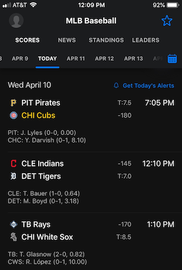

# Developer: Joe Kupresanin
# QA: Max Holiber

Instructions to run app in another environment at the bottom of this page. 

<!-- toc -->

- [Project Charter](#project-charter)
- [Backlog](#backlog)
- [Instructions](#Instructions)

<!-- tocstop -->

## Project Charter 

**Vision**:  
With legalized sports betting, there is a market for selling predictive services to gamblers.  
Main point:  help the bettor consistently beat the MLB over / under runs totals offered by the bookie.  

For each baseball game, the bookie sets an OVER / UNDER line for total runs scored (example below).  
The bettor can wager on OVER if s/he thinks more runs will be scored than the bookie's line.  
Likewise, the bettor can wager on UNDER if s/he thinks fewer runs will be scored than the bookie's line.  

Bets pay even money (less a 10 percent commission), so the bettor must win 55 percent of bets to break even.  


**Mission**:  
Each day, the bettor can pull from the web app the runs total predictions for the slate of today's MLB games.  
These predictions can be used to make educated bets.  

**Success Criteria**:  

**Statistical Criteria**:  
Root mean square error, from the regression, boosted tree, or random forest final model.  
The model will produce a numerical prediction, "Total Runs Scored" for each MLB game today.  
Hope to keep RMSE (test) under 1 run, but not sure at this point.  

**Business Criteria**:  
To win at sports gambling, the bettor needs to win more than 55 percent of wagers placed.  
From deployment through the end of the 2019 MLB regular season, I will use the model and track a running total of wagers won.  
If the app can beat the bookie over the course of the remainder of the baseball season, we will consider it a success.  

**Example Scenario**:  
Say on April 10, there are three MLB games scheduled:  
Pirates vs. Cubs, runs total = 7.5  
Indians vs. Tigers, runs total = 7.0  
Rays vs. White Sox, runs total = 8.5



The above "runs total" values are set by the bookie before the game is played.  
The gambler can bet UNDER if he thinks the game will have fewer runs than the above values.  
The gambler can bet OVER if she thinks the game will have more runs than the above values.  

The user accesses the model early in the day and the predictions are:  
Pirates vs. Cubs, predicted runs = 7.9  
Indians vs. Tigers, predicted runs = 6.4  
Rays vs. White Sox, predicted runs = 9.9  

The best betting opportunity for April 10 is to bet the OVER 8.5 on Rays vs. White Sox.  

If the game has 9 or more runs, the gambler wins.  
If the game has 8 or fewer runs, the gambler loses.  
Bets pay even money, so a $100 bet wins $100.  

The reason the gambler must win more than 55 percent of wagers is the bookie charges a commission to make the wager.  


## Backlog

**Themes**:  
  
1.  A working app that meets the MSiA 423 criteria.  
2.  Enough modeling predictive power to win 55 percent of bets placed.  

**Epics**:  
  
1.1.  Source data from baseball statistics API.  (Next two weeks)  
1.2.  Format the data from json into pandas dataframe.  (Next two weeks)  
1.2.  Build predictive models based on historical 2018 data.  (Next two weeks)  
1.3.  Successfully migrate data / model from API to cloud database.  
1.4.  Implement testing / logging / QA per best practices.  
1.5.  Automate continuous daily data collection (2019 data for today's predictions).  
1.6.  Develop web app for user to obtain daily predictions.  

2.1.  Upon functionality, begin to track if predictions can beat the bookie.  
2.2.  Additional variables can be entered into modeling, but keeping it simple to start:  

Available variables (per day):  
Venue variables (location, stadium, surface, time, etc...)  
Weather variables (temperature, wind, cloud coverage, etc...)  
Matchup variables (starting pitcher record / runs given up / history and team record)  

Additional variables will require table joins and additional API pulls, which can be implemented in the future.  

**Stories**:  

1.1.a.  Learn how to pull API data (website already selected and required variables available) (1/2 day).  
1.1.b.  Learn where to put API data (1/2 day).  
1.1.c.  Revisit manipulating / cleaning / transforming data in Python (1 day).  

1.2.a.  Develop models using Scikit-Learn - likely regression, boosted tree, and random forest (1/2 day).  
1.2.b.  Determine reasonable strategy for train / test split (1/4 day).  
1.2.c.  Strategize to keep this all organized and not haphazard (1/4 day).  

1.3.a.  Learn from instructors how to run things on cloud (5 days).  

1.4.a.  Learn pytest (1/4 day).  
1.4.b.  Write tests (1/4 day).  

1.5.a.  Learn from instructors how to run things automatically (bash scripts, e.g.) (2 days).  

1.6.a.  Learn from instructors how to create working web app (3 days).  

2.1.a.  Daily tracking of model performance / gambling wins (1 hour / day).  

2.2.a.  Adding additional variables to the model for performance improvement (placeholder, not sure if time) (icebox).  

## Instructions

**0. Connect to your EC2 instance on AWS**

**1. Clone the Master branch of the GitHub repo.  In terminal, cd into project directory.**

**2. Create a conda environment, my_env = name of your new environment**

	
	```
	conda create --name my_env python=3.7
	conda activate my_env
	pip install -r requirements.txt


**3.  Move three data files from Joe's S3 bucket to your S3 bucket**

File 1 - All baseball data from 2018 season  
File 2 - All predictions from 2019 season: Beginning of 2019 season until until day this project is cloned  
File 3 - All gambling results from 2019 season: Beginning of 2019 season until day this project is cloned  

	1.  From the terminal, set your AWS environment variable:
		a.  export AWS_ACCESS_KEY_ID=
		b.  export AWS_SECRET_ACCESS_KEY=
	
	2.  From the terminal, edit the config.py and update the following:
		a. `DEST_BUCKET`  (Your S3 bucket name)
	
	3.  Run `python s3.py` in the terminal from the project directory  
	
	4.  Navigate to S3 to see if three files have been transferred to your bucket:
		a.  "model_data"
		b.  "predictions.csv"
		c.  "results.csv"
		

**4. Initialize the database in RDS**

	1.  Set your MYSQL environment variables by running the following commands, all must be in quotes
		export MYSQL_USER="" 
		export MYSQL_PASSWORD=""
		export MYSQL_HOST="" 
		export MYSQL_PORT=""
	
	2.  Run `python Create_RDS_DS.py` to create the MySQL database in RDS
		Populated tables Predictions and Reports will exist with MLB model results from the 2019 season
	
